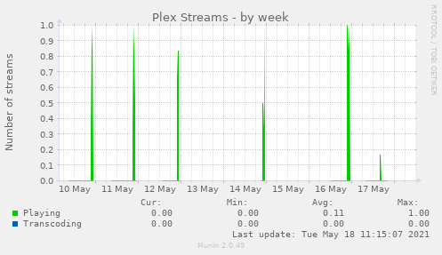
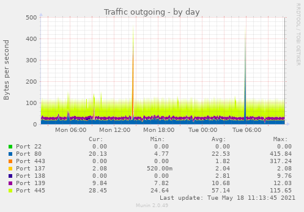

# munin-plugins

Custom munin plugins

## Available plugins

### Plex

Show number of playing / transcoding steams.  
Use https by default.



### Traffic

Show iptables traffic by port.  




You need to create iptable rules with comment, so the plugin can get the required data. Syntax for the comment is `traffic_<incoming|outgoing>:<port>` like this: `traffic_incoming:80`.  
For instance:

```iptables
*filter

[...]

# add comment directly on a rule
-A INPUT -p tcp --dport 80 -j ACCEPT -m comment --comment "traffic_incoming:80"
-A INPUT -p tcp --dport 443 -j ACCEPT -m comment --comment "traffic_incoming:443"

# or on a dedicated line
-I INPUT  -p tcp --dport 22   -m comment --comment "traffic_incoming:22"

# also needed for outgoing traffic
-I OUTPUT -p tcp --sport 22   -m comment --comment "traffic_outgoing:22"
-I OUTPUT -p tcp --dport 80   -m comment --comment "traffic_outgoing:80"
-I OUTPUT -p tcp --dport 443  -m comment --comment "traffic_outgoing:443"

[...]

COMMIT
```

## Installation / configuration

Install plugins in folder `/usr/local/munin/lib/plugins/`. Link them in `/etc/munin/plugins/`:

```sh
ln -s /usr/local/munin/lib/plugins/plex /etc/munin/plugins/plex
ln -s /usr/local/munin/lib/plugins/traffic_* /etc/munin/plugins/.
```

Install configuration files in `/etc/munin/plugin-conf.d/`, and update the configuration accordingly.

## Testing

Test plugins with `munin-run`

```sh
munin-run plex
munin-run traffic_incoming
munin-run traffic_outgoing
```
